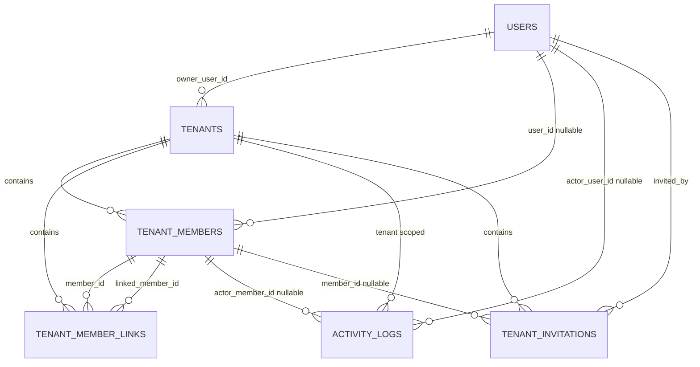
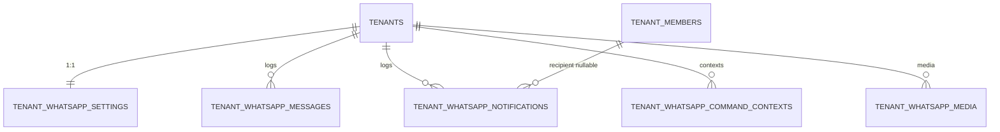
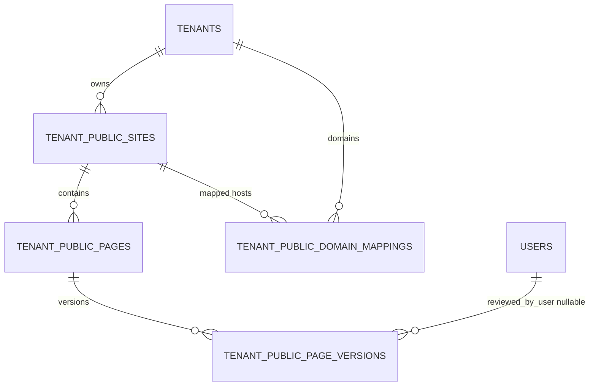

# Global Data Model Blueprint

Dokumen ini mendefinisikan blueprint tabel reusable untuk aplikasi multi-tenant generik.

Kontrak tenant isolation, audit, dan OCC yang ada di dokumen ini harus mengikuti [10-core-standard.md](./10-core-standard.md).

## 1. Core Tables (Required)

- `users`
  - `id`
  - `email` (unique global)
  - profile fields
- `tenants`
  - `id`
  - `owner_user_id` -> `users.id`
  - `name`, `locale`, `timezone`, `plan_code`, `status`
- `tenant_members`
  - `id`
  - `tenant_id` -> `tenants.id`
  - `user_id` -> `users.id` (nullable)
  - `full_name`, `role_code`, `profile_status`
- `tenant_member_links`
  - `id`
  - `tenant_id`
  - `member_id`
  - `linked_member_id`
  - `link_type`, `access_scope`
- `tenant_invitations`
  - `id`
  - `tenant_id`
  - `member_id` (nullable)
  - `invited_by_user_id`
  - `email`, `role_code`, `status`, `token`, `expires_at`
- `activity_logs`
  - `id`
  - `tenant_id`
  - `actor_user_id` (nullable)
  - `actor_member_id` (nullable)
  - `action`
  - `target_type`
  - `target_id`
  - `changes` (json/jsonb)
  - `metadata` (json/jsonb)
  - `request_id`
  - `occurred_at`
  - `result_status`
  - `before_version` (nullable)
  - `after_version` (nullable)
  - `source_ip` (nullable)
  - `user_agent` (nullable)
  - `created_at`
- `notifications`

## 2. Core Relations

- `tenants.owner_user_id -> users.id`
- `tenant_members.tenant_id -> tenants.id`
- `tenant_members.user_id -> users.id` (nullable)
- `tenant_member_links.tenant_id -> tenants.id`
- `tenant_member_links.member_id -> tenant_members.id`
- `tenant_member_links.linked_member_id -> tenant_members.id`
- `tenant_invitations.tenant_id -> tenants.id`
- `tenant_invitations.member_id -> tenant_members.id` (nullable)
- `tenant_invitations.invited_by_user_id -> users.id`

## 3. WhatsApp Module Tables (Optional)

- `tenant_whatsapp_settings`
  - `tenant_id` unique
  - `session_name`, `connection_status`, `connected_jid`, `meta`
- `tenant_whatsapp_messages`
  - `tenant_id`
  - `direction`, `whatsapp_message_id`, `sender_jid`, `recipient_jid`, `payload`
- `tenant_whatsapp_notifications`
  - `tenant_id`
  - `member_id` nullable
  - `notification_type`, `notification_key`, `status`, `context`, `service_response`
- `tenant_whatsapp_command_contexts`
  - `tenant_id`
  - `sender_jid`, `context_type`, `payload`, `expires_at`
- `tenant_whatsapp_media`
  - `tenant_id`
  - `sender_jid`, `mime_type`, `size_bytes`, `storage_path`, `consumed_at`

Detail behavior WhatsApp ada di [40-whatsapp-wwebjs.md](./40-whatsapp-wwebjs.md).

## 4. Workflow Module Tables (Optional)

- `workflows`
  - `row_version`
- `workflow_steps`
- `work_items`
  - `row_version`
- `work_item_completions`
- `work_item_reminders`

Semua tabel wajib punya `tenant_id`.

## 5. Finance Module Tables (Optional)

- `tenant_finance_categories`
- `tenant_finance_transactions`
  - `row_version`
- `tenant_finance_transaction_members`
- `tenant_finance_attachments`

Semua tabel wajib punya `tenant_id`.

## 6. Tenant Public Sites Tables (Required for Tenant Marketing Landing)

- `tenant_public_sites`
  - `tenant_id`
  - `default_locale`, `status`
- `tenant_public_pages`
  - `tenant_id`
  - `site_id`
  - `slug`, `status` (`draft|published|archived`)
  - `published_version_id` (nullable)
- `tenant_public_page_versions`
  - `tenant_id`
  - `page_id`
  - `version_number`
  - `content_schema`
  - `review_status` (`draft|in_review|approved|rejected`)
  - `reviewed_by_user_id` (nullable)
- `tenant_public_domain_mappings`
  - `tenant_id`
  - `site_id`
  - `host`
  - `host_normalized`
  - `is_primary`
  - `verification_status`
  - `verified_at` (nullable)
  - `ssl_status`
  - `ssl_checked_at` (nullable)

Semua tabel wajib punya `tenant_id`.

Constraint minimum:

- unique global `host_normalized` (case-insensitive)
- index resolver: `(host_normalized, verification_status, ssl_status, is_primary)`

## 7. Mandatory Constraints and Patterns

- Semua unique index domain harus tenant-scoped kecuali identifier global (`users.email`, `host_normalized`).
- Semua entity mutable yang rawan concurrency wajib punya `row_version`.
- Update mutable entity wajib pakai compare-and-increment OCC.
- Soft delete pada entity mutable wajib increment `row_version`.
- `activity_logs` append-only: tidak ada update/delete row.

## 8. ERD Core (Mermaid)

## 9. ERD WhatsApp Extension (Mermaid)

## 10. ERD Tenant Public Sites (Mermaid)

